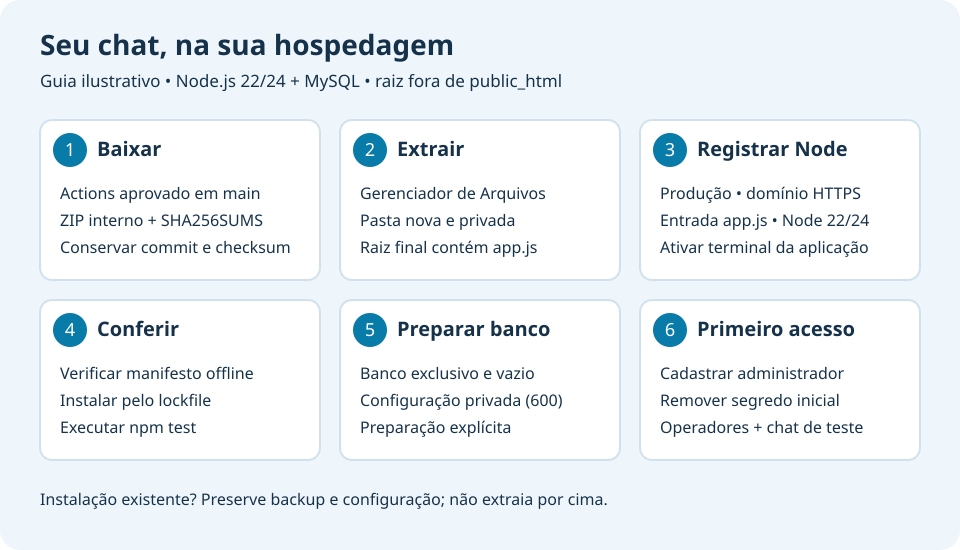

# Baixar, conferir e instalar o pacote

O pacote distribui o código JavaScript pronto para executar, páginas, testes, documentação, licença MIT e lockfile. Não exige compilação, Git, Docker, Redis ou conta do autor para **instalar e operar**. Ainda precisa de Node.js 22/24, npm, HTTPS, MySQL/MariaDB e terminal da aplicação no cPanel. Hospedagem e domínio são fornecidos por quem instala. O projeto está em homologação; não é uma garantia de uso em produção.



A imagem é uma ilustração das etapas, sem dados reais de conta. Campos e botões variam conforme o provedor; ela não é uma captura nem prova de homologação de outro cPanel.

## Obter o ZIP

Em [Actions do projeto](https://github.com/ThiagoSlva/ChatCrm/actions), selecione uma execução de `main` aprovada com o job `package`. Baixe o artefato `conversa-livre-<commit>`: ele contém `conversa-livre.zip` e `SHA256SUMS`. Extraia o **envelope do artefato** no seu computador, para obter esses dois arquivos. O ZIP interno é o pacote de instalação.

O [GitHub exige login para baixar artefatos de Actions](https://docs.github.com/en/actions/how-tos/manage-workflow-runs/download-workflow-artifacts), mesmo em repositórios públicos. Esses artefatos duram 30 dias; código e gerador permanecem no repositório. GitHub é uma opção de distribuição, não uma conta necessária para o funcionamento do chat. Releases permanentes sem login e instalação sem terminal continuam pendentes. Não confunda `Download ZIP` do código-fonte com o pacote verificado: o snapshot do repositório não traz `.release.json`.

Confira o commit da execução e conserve o ZIP/checksum em lugar confiável. SHA256 comprova igualdade dos bytes; não comprova autoria quando arquivo e checksum vêm de uma mesma origem comprometida. Este formato não é assinado nem criptografado. Backups com dados jamais integram o pacote.

## Extrair no cPanel

1. Pelo Gerenciador de Arquivos, crie uma pasta privada, como `apps/chatcrm-novo`, **fora de public_html**. Não use a pasta de uma instalação existente.
2. Envie `conversa-livre.zip` para essa pasta e use Extrair. A estrutura resultante será `apps/chatcrm-novo/conversa-livre/app.js`.
3. No gerenciador Node.js, registre a raiz **que contém app.js**, selecione produção, Node22 ou24 e o domínio HTTPS. Ative no terminal o ambiente que o painel mostrar e entre nessa raiz.
4. Antes de configurar o banco, confira a extração, sem Git, dependências ou conexão SQL:

   ```sh
   node scripts/package-release.js --verify-directory "$PWD"
   ```

   `ok:true`, versão e commit são os critérios. A conferência lê apenas os arquivos listados no manifesto e seus hashes; não valida `.env`, node_modules, configuração do provedor ou arquivos adicionais. Nenhum arquivo é corrigido ou apagado.

5. Instale as dependências do lockfile e execute os testes:

   ```sh
   npm ci --omit=dev --ignore-scripts --no-audit --no-fund
   npm test
   ```

   npm precisa acessar o registro para baixar dependências. Não há node_modules no ZIP; as dependências conservam suas licenças na instalação. Nenhuma senha padrão, telemetria obrigatória ou serviço de ativação é incluído.

6. Siga [Configuração privada e preparação do banco](INSTALADOR-CPANEL.md#configuração-privada): criar banco exclusivo vazio, guardar `.env` privado600, diagnosticar, preparar explicitamente e concluir o primeiro cadastro em `/acesso`. Remova o segredo de instalação depois. O ZIP não migra, cria banco, muda credenciais ou reinicia aplicações automaticamente.

Se o gerenciador exigir uma entrada Passenger específica, adapte segundo a documentação do seu provedor. `passenger.cjs` é destinado ao fluxo de releases `current/releases`; **não** é a entrada da instalação direta. Nesta, use `app.js`. `health.commit` pode ser `null` na instalação direta sem APP_COMMIT configurado; o manifesto/`--verify-directory` identifica a revisão distribuída. O ambiente de deploy por Git continua preenchendo o hash servido como antes.

## Verificar o ZIP antes de extrair

Se já tiver o código e Node, o verificador funciona offline e não lê `.env`:

```sh
node scripts/package-release.js --verify /CAMINHO/ABSOLUTO/conversa-livre.zip
```

Também compare o SHA256 total com `SHA256SUMS`, usando `sha256sum` no Linux ou `Get-FileHash -Algorithm SHA256` no PowerShell. Não use um arquivo suspeito como origem do próprio verificador; obtenha ferramentas e checksum da revisão confiável. O verificador aceita exclusivamente o ZIP produzido pelo gerador, com arquivos regulares, sem travessia, duplicados, links ou compressão arbitrária; não é um extrator de ZIP genérico.

## Reproduzir como mantenedor

Gerar exige Git e checkout do projeto, com a revisão já commitada. Não lê arquivos locais, dados privados, node_modules ou referências de pesquisa. Alterações não commitadas não entram no pacote; revise/commite antes de gerar e confira o SHA retornado.

Para quem mantém ou adapta o frontend, o ZIP inclui `AGENTS.md` e a [skill de qualidade do projeto](skills/chatcrm-frontend-quality/SKILL.md), com revisão de teclado, largura móvel e estados da interface. A partir da v0.12.3, a geração exige os dois arquivos; somente essa skill pública específica é permitida. Outras pastas de skills e memórias privadas continuam excluídas. Os ZIPs anteriores conservam a verificação de integridade do formato1, mesmo sem essa instrução adicional.

```sh
npm run release:package -- --output /PASTA/EXISTENTE/conversa-livre.zip
npm run release:package -- --output /PASTA/EXISTENTE/repeticao.zip --commit SHA_COMPLETO_DE_40_CARACTERES
```

Substitua o SHA pelo mesmo commit da primeira saída. O gerador lê blobs Git de uma lista permitida, ordena os arquivos e usa metadados ZIP fixos. Mesmo commit significa mesmos bytes, inclusive em checkout Windows/Linux com finais de linha locais diferentes. Não depende de data, hostname ou configuração da máquina. Saída nunca substitui um arquivo; o diretório deve existir. Interrupção de escrita pode deixar arquivo incompleto: preserve, verifique e use outro nome após diagnóstico; não o distribua como pronto.

Manifesto `.release.json`: formato1, versão, commit, árvore Git e SHA256/tamanho de cada fonte distribuída. Limites: 500 arquivos, 16MiB por pacote. O ZIP é armazenado sem compressão para manter formato pequeno e verificável; o envelope de Actions pode comprimi-lo. Não inclui `.git`, `.github`, `.cpanel.yml`, storage, `.env` real, dumps, logs, dados de clientes ou código GPL de referência. Apenas `.env.example` genérico é incluído. [A ação oficial de artefatos](https://github.com/actions/upload-artifact) está fixada numa revisão e recebe somente ZIP/checksum públicos, após os testes em22/24 e no pacote extraído; permissões do workflow continuam `contents: read`.

## Atualizar uma instalação

O pacote é para pasta nova. Não extraia sobre código/configuração em uso: preserve backup atual, configuração privada e release compatível, valide a pasta nova e siga [Deploy cPanel](DEPLOY-CPANEL.md). Migrações e ativação são explícitas. Um checksum aprovado não comprova restauração; consulte [backup e recuperação](BACKUP-RESTAURACAO.md).

## O que foi verificado

Testes exercitam reprodução, lockfile, CRC/SHA, alterações de manifesto, nomes/offsets inválidos, limites, recusa de sobrescrita e verificação offline. CI extrai com `unzip`, verifica os arquivos e executa a suíte a partir do pacote. As evidências da execução concreta ficam em [Andamento](ANDAMENTO.md). Reproduzir e testar fontes não comprova a instalação por uma pessoa iniciante, todo gerenciador Node, proxy Passenger, recuperação da hospedagem ou uso em produção.
