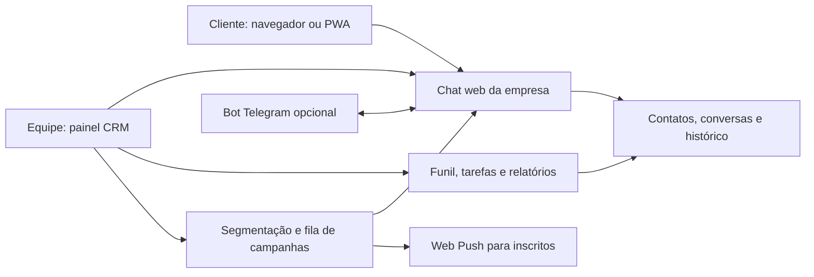

# Viabilidade de CRM com chat próprio

Pesquisa e inspeção de código realizadas em **01/10/2026**.

> Histórico: este parecer precede a definição de distribuição gratuita e auto-hospedagem em cPanel. As recomendações de produto e tecnologia atuais estão em [PLANO-IMPLEMENTACAO.md](PLANO-IMPLEMENTACAO.md), com a análise posterior de Node.js em [ANALISE-NODEJS-CPANEL.md](ANALISE-NODEJS-CPANEL.md). As constatações sobre Telegram e os downloads continuam válidas.

## Parecer

**É possível criar o produto proposto:** cada empresa pode ter um endereço de atendimento com sua marca, um painel com vários atendentes, gestão de leads e campanhas para clientes que aderiram ao canal.

**O código aberto do Telegram não entrega esse produto pronto.** Ele oferece aplicativos que dependem da infraestrutura do Telegram. Para uma rede independente precisamos desenvolver o serviço de mensagens ou aproveitar uma plataforma que realmente permita hospedagem própria. Minha recomendação é lançar um CRM com atendimento web próprio e Telegram como integração opcional, usando uma base de atendimento existente para acelerar o piloto.

Podemos oferecer o software gratuitamente. Operar servidores, armazenar arquivos, manter backups, desenvolver e prestar suporte continua tendo custo. Uma versão gratuita precisa de limites e uma fonte de financiamento, ou pode ser instalada na infraestrutura da própria empresa.

## O que foi baixado e verificado

Os endereços abaixo foram confirmados pelos links de código-fonte da [página oficial de aplicativos do Telegram](https://telegram.org/apps).

| Referência | Pasta local | Commit analisado | Licença declarada no package.json |
|---|---|---|---|
| [Telegram Web A](https://github.com/Ajaxy/telegram-tt) | `referencias/telegram-web-a` | `28ffcf710b15571e5a2f7bb3bdce3fc90fc8ec80` | GPL-3.0-or-later |
| [Telegram Web K](https://github.com/morethanwords/tweb) | `referencias/telegram-web-k` | `e55552763f3dcca269230bb7487213bbaf82ff6a` | GPL-3.0-only |

Downloads com `git clone --depth 1`; os dois submódulos declarados no Web K também foram baixados nas revisões fixadas pelo repositório. A validação `git fsck --connectivity-only` passou nos dois projetos principais, e `git status --porcelain` retornou vazio. Isso verifica o download e a preservação do código, não seu funcionamento em produção.

Foram inspecionados READMEs, licenças, instruções dos repositórios, scripts, requisitos de runtime e caminhos de autenticação, transporte e envio de mensagens. Não houve instalação de dependências, compilação, login em contas ou envio de mensagens. É uma avaliação de arquitetura por inspeção estática, não uma auditoria completa de segurança.

## O que o código mostra

### Telegram Web A

Usa TypeScript, Teact — uma biblioteca própria com paradigma semelhante ao React — e uma versão adaptada do GramJS para MTProto. O pacote atual usa Vite. Há implementação de interface de chat, mídia, workers e recursos de PWA. O [README do projeto](https://github.com/Ajaxy/telegram-tt) descreve essa estrutura.

Evidências no snapshot local:

- `src/config.ts`, linhas 41–42: obtém o identificador e o hash da aplicação Telegram.
- `src/api/gramjs/methods/client.ts`, linhas 112–113: utiliza essas configurações na inicialização do cliente.
- `src/api/gramjs/methods/messages.ts`, linha 639: envia texto por `GramJs.messages.SendMessage`.

Esses caminhos demonstram uma aplicação que chama a API Telegram. Uma nova marca ou hospedagem do frontend não substitui o serviço que autentica, persiste e entrega as mensagens.

### Telegram Web K

Usa TypeScript, um fork de Solid e implementação própria de MTProto. Tem gestores de chats, usuários e mensagens, além de transporte e cache no navegador.

Evidências no snapshot local:

- `src/lib/mtproto/dcConfigurator.ts`, linha 60: monta um endereço WebSocket em `web.telegram.org`.
- O mesmo arquivo, linhas 70–79: declara endereços de data centers de teste e produção.
- `src/lib/appManagers/appMessagesManager.ts`, linha 3167: escolhe chamadas `messages.sendMessage` ou `messages.sendMedia`.

Existe muito trabalho útil para estudar experiência de mensagens, mas a estrutura de dados e os fluxos estão ligados à API Telegram. Minha avaliação é que substituir essa camada, acrescentar isolamento de empresas e implementar CRM tende a exigir mais trabalho do que começar com uma base de atendimento adequada.

### Requisitos para eventualmente executar as referências

O `package.json` do Web A exige Node `^24.15 || ^26` e npm `^11 || ^12`. O Web K exige Node `^22.18.0 || >=24.11.0` e declara pnpm `11.16.0`. O ambiente encontrado tinha Node `22.15.0` e npm `10.9.2`, portanto não atende aos requisitos declarados. Nenhuma atualização global foi feita.

Um teste real de cliente Telegram também requer configuração própria da aplicação e autenticação. As instruções oficiais explicam como [obter api_id e api_hash](https://core.telegram.org/api/obtaining_api_id). O download já está disponível para estudo; sua execução ainda não foi validada.

## A limitação central do Telegram

O próprio Telegram informa que não publicou o código do servidor e que seu serviço não suporta a criação de nuvens independentes por federação. Portanto, não existe um servidor oficial aberto que possamos simplesmente baixar e oferecer como o mensageiro de cada empresa. Fonte: [FAQ oficial, código do servidor e servidor próprio](https://telegram.org/faq#q-can-i-get-telegram-39s-server-side-code).

As APIs permitem criar clientes e integrações, mas os usuários continuam na rede Telegram. A TDLib também é uma biblioteca para clientes dessa rede. Hospedar o servidor local da Bot API muda a operação da integração, não cria uma rede de usuários independente. Fonte: [visão geral das APIs](https://core.telegram.org/api).

Também não ganhamos acesso aos destinatários do WhatsApp: uma lista de telefones não se transforma automaticamente em usuários do nosso chat ou assinantes de um bot.

## Caminhos possíveis

As classificações de esforço abaixo são minha avaliação técnica, não métricas publicadas pelos projetos.

| Caminho | Independência | O que ainda falta | Adequação ao objetivo |
|---|---|---|---|
| Adaptar Telegram Web A/K | Continua dependendo do Telegram | CRM, permissões empresariais, operação de campanhas e integração com contas | Serve para um cliente Telegram especializado; pouca vantagem para uma rede própria |
| CRM com bot Telegram | Painel próprio, canal dependente do Telegram | CRM e campanha com destinatários habilitados | Bom canal adicional para clientes que já usam Telegram |
| Atendimento web hospedado por nós, com Chatwoot como base | Canal web sob nossa operação | Funil comercial, campanhas no canal próprio, identidade da marca e chat interno dedicado | Melhor candidato para validar rápido |
| CRM e mensageiro web desenvolvidos por nós | Maior controle de produto e dados | Serviço de mensagens, interface, CRM e operação completos | Bom caminho após validar adesão e necessidade de personalização |
| CRM sobre Matrix/Synapse | Servidor próprio e protocolo aberto | Camada de CRM, experiência do cliente e operação do servidor | Avaliar se federação e mensageria geral forem requisitos centrais |

O [Chatwoot](https://github.com/chatwoot/chatwoot) oferece atendimento web, caixa de entrada de canais, contatos e colaboração. Isso o torna uma base mais próxima do problema. Seu repositório reúne funcionalidades de diferentes edições: cada requisito deve ser conferido na edição escolhida. O núcleo fora das exceções usa MIT, enquanto `enterprise/` possui licença separada, conforme a [licença do projeto](https://github.com/chatwoot/chatwoot/blob/develop/LICENSE). Não se deve presumir que todos os recursos do repositório sejam gratuitos.

Notas privadas em atendimentos ajudam a equipe, mas não equivalem a um chat interno completo com salas, mensagens diretas e notificações. Esse módulo precisaria de implementação própria ou integração.

O [Synapse](https://github.com/element-hq/synapse) pode ser operado como servidor Matrix sob AGPL, ou com licença comercial alternativa. É uma opção real de servidor próprio, mas não oferece o CRM proposto pronto. A distribuição e os produtos comerciais do fornecedor têm condições próprias.

## Como seria o produto recomendado

Uma loja recebe um endereço como `atendimento.exemplo.com/loja-x`. O cliente abre um link ou QR code e conversa no navegador, sem precisar de WhatsApp ou Telegram. A empresa recebe a conversa no painel, registra o lead, atribui um responsável e acompanha o negócio até a venda.

A primeira conversa pode ser simples. Para voltar ao histórico em outro dispositivo, o cliente precisa de um mecanismo de identificação verificável. Um link público para iniciar atendimento não pode expor o histórico de outro cliente; sessões, recuperação de acesso e identidade devem ser projetadas desde o início.

Depois, o cliente pode aderir a novidades da empresa. A campanha aparece na sua caixa de mensagens do portal; uma notificação pode avisar sobre a novidade quando o dispositivo permitir. Importar um contato no CRM não é suficiente para habilitar entrega por esse canal.

**O desafio comercial principal é a adesão:** no WhatsApp o cliente já tem o aplicativo e o hábito de verificar as mensagens. No canal próprio, precisamos conquistar visitas recorrentes ou adesão às notificações. Começaria com atendimento, orçamentos, acompanhamento de pedidos e pós-venda para demonstrar valor antes de apostar em campanhas em massa.

## Arquitetura proposta

No piloto acelerado, o serviço de atendimento pode ser o Chatwoot hospedado por nós, integrado por APIs e webhooks a um módulo comercial. É necessário validar previamente se o fluxo de mensagens proativas escolhido cabe nas APIs e na edição comunitária; não assumir que um chat de suporte já entrega uma campanha persistente completa.

Se a opção for código próprio, proponho uma aplicação web responsiva/PWA, API em TypeScript, PostgreSQL para dados duráveis, WebSocket para atualizações e uma fila persistente para campanhas. Anexos ficam em armazenamento de objetos, separados do banco. Escolher bibliotecas e suas licenças na implementação; esta composição é uma proposta de arquitetura, não um sistema já montado.

Cada consulta, evento, arquivo e tarefa precisa validar a empresa e a autorização do usuário. Um `tenant_id` informado pelo navegador não pode ser a única proteção. Para instalação individual, cada empresa pode ter uma instância; para SaaS, várias empresas podem compartilhar infraestrutura com isolamento efetivamente testado.

Mensagem aceita pelo servidor, entregue ao canal e lida pelo cliente são estados diferentes. O sistema deve registrar apenas o que consegue comprovar. No Telegram via Bot API, sucesso de envio não deve ser apresentado como confirmação de leitura do destinatário.

## Disparos e notificações

### Pelo canal próprio

Proponho segmentação de contatos inscritos, programação de campanhas, cancelamento, limitação por empresa, exclusão de quem saiu da lista, prevenção de duplicação e relatórios de entrega e leitura quando disponíveis. A permissão precisa ser conferida novamente no momento do envio, inclusive para campanhas já agendadas.

Uma mensagem pode ficar persistida no portal mesmo que o cliente esteja offline. Avisar o dispositivo é outra etapa: Web Push exige inscrição e depende do navegador, sistema e disponibilidade do serviço. Não podemos prometer notificação universal ou leitura garantida. Fonte: [documentação da Push API](https://developer.mozilla.org/en-US/docs/Web/API/Push_API).

Se o cliente nunca acessou o canal ou não autorizou notificações, precisaremos de outro meio de convite, como site, material impresso ou e-mail quando aplicável. SMS e e-mail têm custos e características de entrega próprios.

### Pelo Telegram

Para bots comuns em conversas privadas, o usuário precisa enviar uma mensagem primeiro. Não é possível importar telefones e começar a disparar para todos. Fonte: [introdução oficial aos bots](https://core.telegram.org/bots#how-are-bots-different-from-users).

O limite gratuito de difusão é aproximadamente **30 mensagens por segundo por bot**, com limites adicionais por chat/grupo. Há uma modalidade de difusão paga para maior velocidade. Portanto, Telegram gratuito também não significa disparo ilimitado. Fonte: [limites oficiais de bots](https://core.telegram.org/bots/faq#my-bot-is-hitting-limits-how-do-i-avoid-this).

O envio deve usar fila, respeitar `retry_after` em respostas 429 e parar de tentar alcançar usuários que bloquearam o bot. Integrações Telegram Business seguem regras e capacidades específicas, que precisariam de avaliação adicional; não foram usadas como premissa de gratuidade.

## Licenças e marca

Os clientes web usam GPLv3. É possível estudar, modificar e usar comercialmente o código, cumprindo a licença. Se distribuirmos um frontend derivado — inclusive JavaScript servido aos navegadores — precisamos preservar os avisos e fornecer o código-fonte correspondente nos termos aplicáveis. Não basta retirar o logotipo. Fonte: [licença presente no Web A](https://github.com/Ajaxy/telegram-tt/blob/master/LICENSE).

Isso não determina automaticamente a licença de todo backend independente. O alcance depende de como o código é combinado e distribuído. O plano mais simples para este projeto é desenvolver a identidade e a interface próprias, mantendo as referências baixadas para estudo e usando integrações por API quando úteis.

Se criarmos um cliente conectado à rede Telegram, os termos exigem identificação própria da aplicação, transparência sobre a integração e restrições de uso da marca e do logotipo. Fonte: [termos da API Telegram](https://core.telegram.org/api/terms).

## O que significa oferecer gratuitamente

| Modelo | O que pode ser gratuito | Quem paga a operação |
|---|---|---|
| Software aberto para instalação própria | Licença do produto e acesso ao código | A empresa paga ou fornece infraestrutura e manutenção |
| SaaS com plano gratuito | Uso dentro de uma cota definida | Nós subsidiamos a cota e financiamos com planos pagos ou outra receita |
| Serviço subsidiado | Uso gratuito para os beneficiários | Patrocinador, parceiro ou orçamento próprio |

Recomendo versão aberta instalável e um plano hospedado gratuito com cotas iniciais pequenas, ajustadas após medir uso. Serviços opcionais de implantação, armazenamento adicional e suporte podem financiar a operação. A licença final do nosso código ainda precisa ser escolhida conforme a base efetivamente utilizada.

Não existe tarifa da Meta para mensagens trocadas exclusivamente no nosso chat. Entretanto, servidor, banco, tráfego, anexos, backups, observabilidade e trabalho continuam sendo consumidos. Integração WhatsApp permanece sujeita às condições desse canal.

A premissa sobre cobrança precisa dessa precisão: a WhatsApp Business Platform cobra determinadas mensagens entregues, segundo categoria e mercado, e também tem situações de gratuidade, como mensagens de atendimento dentro da janela aplicável. Não é uma cobrança universal de toda conversa pessoal. Fonte: [preços oficiais da plataforma](https://business.whatsapp.com/products/platform-pricing).

Antes de fixar preços, medir custo por empresa ativa, armazenamento por contato, conexões simultâneas, volume de campanhas e horas de suporte. Este estudo não apresenta uma cotação de hospedagem ou promessa de operação a custo zero.

## Entrega em etapas

1. **Validar o canal com poucas empresas:** link/QR code, conversa real, retorno do cliente e levantamento das tarefas comerciais. Confirmar que os clientes aceitam o novo canal.
2. **MVP de atendimento e vendas:** empresas e usuários, permissões, contatos, caixa de entrada compartilhada, responsáveis, tags, notas, funil, tarefas e histórico persistente. Separar notas internas de mensagens para o cliente.
3. **Campanhas:** adesão por canal, segmentos, agendamento, fila durável, cancelamento, descadastro e resultados. Acrescentar Web Push e integração Telegram conforme a demanda validada.
4. **Operação comercial:** relatórios, exportação e exclusão de dados, política de retenção, recuperação de backups, auditoria, limites por empresa e controle de acesso. Ampliar o chat interno para salas e mensagens diretas se necessário.
5. **Expansão:** automações, APIs externas, personalização de domínio e recursos comerciais especializados, guiados pelo piloto.

Critérios mínimos de aceite: uma empresa não acessa os dados de outra; cliente recupera apenas seu histórico; atendentes podem transferir conversas; mensagens sobrevivem a reinícios; campanha não duplica após retentativa; descadastro bloqueia envios futuros; anexos exigem autorização; restauração de backup é demonstrada.

Para planejamento inicial, um piloto com base existente pode levar **4–8 semanas**, e um MVP próprio restrito **8–16 semanas**, assumindo um desenvolvedor experiente dedicado, escopo estável e sem chamadas de voz/vídeo. São estimativas minhas, sujeitas à prova técnica e ao escopo; um CRM completo exige evolução além do MVP.

## Decisão recomendada

**Avançar com CRM e atendimento web próprio, começando por um piloto sobre uma base de atendimento hospedável como Chatwoot.** Manter Telegram como canal adicional e os clientes web baixados como material de referência. Validar identidade do cliente, mensagens proativas, edição/licenças e integração do funil antes de escolher definitivamente a base.

O posicionamento possível é: **“Atendimento e vendas no seu próprio canal, com a marca da empresa e menos dependência de mensageiros externos.”** O benefício deve ser comprovado pela experiência do cliente e pelo resultado comercial. Gratuidade do software e ausência de tarifa por mensagem no canal próprio são viáveis; custo total zero e alcance automático de todos os contatos não são premissas viáveis.
